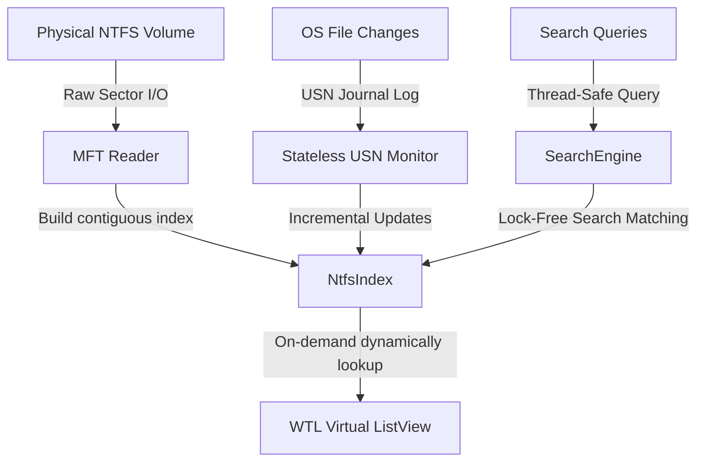

# 🚀 FastSearch

**FastSearch** is an instant filename search engine that quickly locates files and folders by name on Windows. Searches 1million files in 2 Seconds. Built with modern C++.
### How is Everything different from other File search engines
* Small Portable installation file(<1MB).
* Clean and simple user interface.
* Quick file indexing.
* Quick searching.
* Quick startup.
* Minimal resource usage.
* No database on disk.
* Real-time updating.
#### [Download FastSearch from Releases](https://github.com/Dinesh6777/FastSearch/releases)


---

## ✨ Features
FastSearch is built with modern C++, WTL (Windows Template Library), and ATL, it parses raw NTFS Master File Tables (MFT) directly to index millions of files in seconds, delivering high-performance, real-time search results with an incredibly compact memory footprint.
*   **⚡ Sub-Second MFT Indexing**: Directly parses raw NTFS Master File Table (MFT) partitions using sector-aligned raw disk I/O, indexing over 1,000,000 files in under 2 seconds.
*   **🧠 Ultra-Low Memory Footprint**: Consolidated RAM consumption down to under **90 MB** using a custom 8-byte `CompactString` pointer architecture, Contiguous sparse record storage, and zero-allocation dynamic result lookups.
*   **🔄 Real-Time USN Synchronization**: Tracks all filesystem additions, deletions, renames, and attributes in real-time by reading the Windows Update Sequence Number (USN) Journal.
*   **🔌 Stateless Hot-Plugging & Safe Ejection**: Implements a stateless on-demand polling mechanism and robust PnP device interface translations (GUID volume resolution). Instantly indexes newly attached USB drives and allows safe ejection on the very first click without locking the drive.
*   **💻 Native Windows UI**: Built with a sleek, borderless WTL frame using Segoe UI typography, smooth micro-animations, customizable views (Details, Large Icons, Extra Large Icons), instant character highlighting, and seamless system tray minimization.
*   **📋 Full Explorer Bindings**: Supports standard Windows Clipboard operations (Copy, Cut, Paste) and full OLE Drag-and-Drop compatibility directly into Windows Explorer.
*   **🔍 Multiple Match Modes**: Supports Plain Text, Wildcard matching (`*`, `?`), and regular expressions (Regex) in a thread-safe search interface.

---

## 🏗️ Architecture Design

FastSearch achieves high performance and low resource usage through several advanced memory and systems-engineering strategies:



1.  **Contiguous Contained Vector**: Stores file structures inside a flat contiguous vector (`std::vector<std::unique_ptr<FileRecord>>`) indexed by FRS (File Reference Segment) numbers, enabling O(1) random access lookups.
2.  **CompactString (8-byte strings)**: Custom-engineered string class that replaces standard 40-byte `std::wstring` structures by managing a single 64-bit raw pointer, reducing structure size by 36%.
3.  **On-Demand View Rendering**: The Virtual List View (`LVS_OWNERDATA`) retrieves visible row strings on-the-fly from the index via thread-safe shared locks, keeping search results at a lightweight 8 bytes per item.

---

## 🛠️ Getting Started

### System Requirements
*   **OS**: Windows 10 or Windows 11 (64-bit)
*   **Permissions**: Administrator elevation (required to perform raw sector read access on NTFS physical disks and query the USN Journal).
*   **File System**: NTFS formatted partitions (FAT32/exFAT are not supported for raw MFT parsing).

### Build Prerequisites
*   **IDE**: Visual Studio 2022 (with "Desktop development with C++" workload installed)
*   **SDK**: Windows 10 SDK (10.0.17763.0 or higher)
*   **Libraries**: WTL (Windows Template Library) NuGet package (automatically resolved on build)

### Building the Project
You can build the project directly using Visual Studio or from the command line using MSBuild:

```powershell
# Navigate to the source folder
cd Src

# Rebuild in Release mode for x64
msbuild FastSearch.sln /p:Configuration=Release /p:Platform=x64 /t:Rebuild
```

The compiled binary will be generated at:
`Src\x64\Release\FastSearch.exe`

---

## 📝 License

This project is released under the terms of the **MIT License**.

```text
MIT License

Copyright (c) 2026

Permission is hereby granted, free of charge, to any person obtaining a copy
of this software and associated documentation files (the "Software"), to deal
in the Software without restriction, including without limitation the rights
to use, copy, modify, merge, publish, distribute, sublicense, and/or sell
copies of the Software, and to permit persons to whom the Software is
furnished to do so, subject to the following conditions:

The above copyright notice and this permission notice shall be included in all
copies or substantial portions of the Software.

THE SOFTWARE IS PROVIDED "AS IS", WITHOUT WARRANTY OF ANY KIND, EXPRESS OR
IMPLIED, INCLUDING BUT NOT LIMITED TO THE WARRANTIES OF MERCHANTABILITY,
FITNESS FOR A PARTICULAR PURPOSE AND NONINFRINGEMENT. IN NO EVENT SHALL THE
AUTHORS OR COPYRIGHT HOLDERS BE LIABLE FOR ANY CLAIM, DAMAGES OR OTHER
LIABILITY, WHETHER IN AN ACTION OF CONTRACT, TORT OR OTHERWISE, ARISING FROM,
OUT OF OR IN CONNECTION WITH THE SOFTWARE OR THE USE OR OTHER DEALINGS IN THE
SOFTWARE.
```

---

## 🤝 Contributing

Contributions are welcome! Please feel free to open pull requests, submit bugs, or suggest new optimization layers to the FastSearch index engine.
